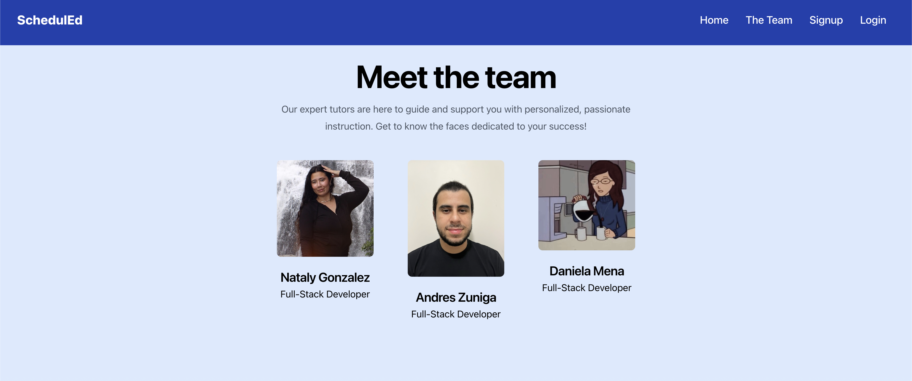
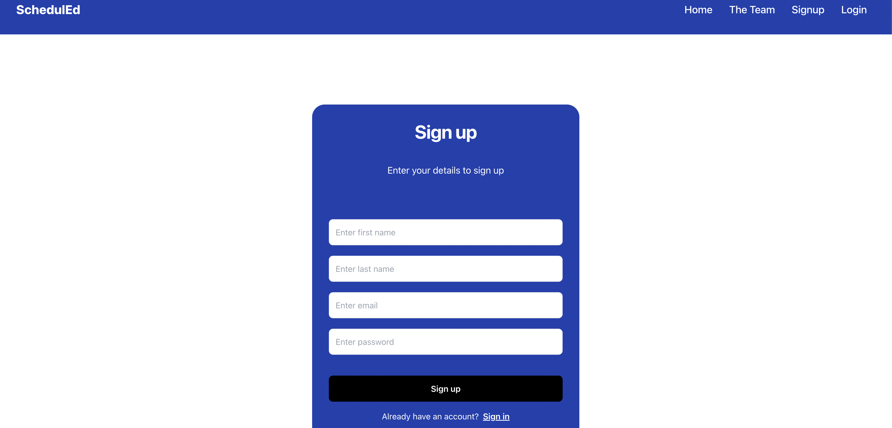
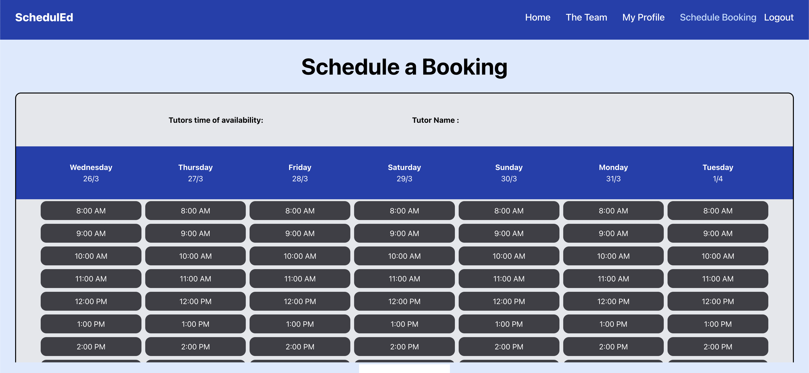

# SchedulEd







## Link
https://scheduled-tcqp.onrender.com

## Table of Contents

- [Description](#Description)
- [Images](#images)
- [Installation](#installation)
- [Usage](#Usage)
- [links](#links)
- [Technologies Usage](#technologies-usage)
- [Contributing](#contributing)

## Description
Welcome to SchedulEd -
SchedulEd is an easy-to-use platform that helps tutors and students stay on top of bookings, homework, and payments without the hassle. It keeps things organized so tutors can focus on teaching and students can focus on learning.

## User story
```md
As a small business owner,
I want to seamlessly schedule my tutoring sessions
So that I can organise my work and bookings effectively

As a student,
I want a facilitating and user-friendly site for me to access booking sessions, homework, and payment plans
So that I can have an easier time organising my studies and be stress free.
```


## Images 


## Installation
You will need to download Node.js to locally run the application. Please refer to the link below:
https://nodejs.org/en/download/package-manager


## Usage 
For usage, you may simply use the application via the link provided below. However, if you would like to run it locally, simply follow these steps:

- clone the repositoty
- open your terminal and go to the root directory of the repository folder
- run npm i ;
- npm run develop 


## Links 


## Technologies Usage
Our website is built using a modern web development stack to ensure a smooth and efficient user experience.
- React.js
- MongoDB and Mongoose OBM
- Express.js
- Node.js
- React icons npm
- Toastify npm

Company logo designed with Canva.


## Contributing
We welcome contributions from the community! If you'd like to contribute, please follow these steps:

- Fork the repository.
- Create a new branch for your feature or bugfix.
- Make your changes and commit them with a descriptive message.
- Push your changes to your fork.
- Open a pull request with a detailed description of your changes.